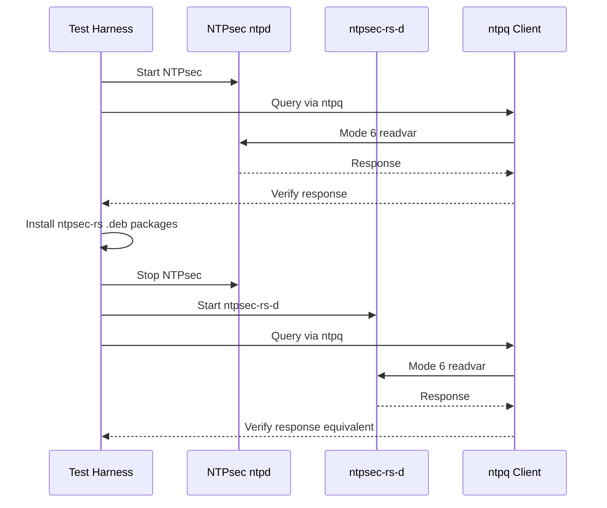

# Forensic Parity Court Methodology

ntpsec-rs uses the same **forensic parity court method** proven in chrony-rs.
This document describes the methodology in full detail.

## Core principle: Byte parity, behavior parity, operational-knowledge parity

Every behavior admitted into ntpsec-rs must be backed by a **court** — a
reproducible, documented body of evidence that demonstrates the Rust behavior
matches the real NTPsec C implementation.

## The four pillars

### 1. Deep Doxygen / source archaeology

Every ntpsec C translation unit is indexed using Doxygen to extract:

- Function signatures (name, parameters, return type)
- Static/global variable declarations
- Macro constants and their values
- Enumerations and their discriminants
- Struct layouts and field types
- Control flow between functions

This index is stored in `docs/research/` and serves as the structural oracle.
The Rust implementation is developed from this index — never from reading the C
code directly (to maintain clean-room status).

### 2. Deterministic-trace replay

Real NTPsec `ntpd` packet traces (captured via `tcpdump` / `pcap`) are replayed
through the Rust code. Every received packet is fed to the Rust implementation,
and the resulting state transitions and output packets are compared byte-for-byte
against what the real `ntpd` produced in response.

Trace captures are stored in `docs/courts/traces/` with metadata describing the
capture environment, configuration, and expected behavior.

### 3. Protocol-spec cross-check

NTP RFCs and NIST known-answer tests are used to classify behavior:

- **Protocol truth**: behavior required by RFC 5905 (NTPv4), RFC 8915 (NTS),
  etc. This is the baseline standard.
- **NTPsec policy**: behavior where NTPsec's implementation differs from the
  generic protocol. These are documented as NTPsec-specific choices and are
  cross-checked against the C oracle.
- **Bug compatibility**: known NTPsec bugs (tracked in the NTPsec issue tracker)
  that ntpsec-rs may need to replicate for drop-in replacement parity.

### 4. Court-backed evidence

Every admitted behavior is documented in a **court file** in `docs/courts/`.

Each court file contains:

```markdown
# Court: ntp_fp — dolfptoa format

## Claim
dolfptoa seconds.fraction matches ntpsec's output exactly for
positive, negative, zero, edge case values.

## Evidence
### Test output (ntpsec-rs)
```
$ cargo test -p ntpsec-rs-core dolfptoa
<test output>
```

### Oracle output (ntpsec C)
```
$ ./tests/dolfptoa-test
<ntpsec output>
```

### Byte comparison
<diff showing identical output>

## Witnesses
- RFC 5905 §6 — timestamp format definition
- ntpsec libntp/dolfptoa.c — structural oracle (via Doxygen index)
- Test vector generated from ntpsec 1.3.3

## Verdict
PASS — bytes match.
```

## Clean-room enforcement

ntpsec-rs enforces a strict clean-room protocol:

1. **No ntpsec C source in the repository**: The `.gitignore` and a CI check
   (`cargo xtask check`) reject any file originating from the ntpsec repository.
2. **Doxygen index only**: The structural oracle is a Doxygen-generated index
   (abstracted function signatures and constants), never verbatim C source.
3. **Oracle VM**: Real ntpsec binaries run in Docker containers for behavioral
   comparison. The binaries are never decompiled or reverse-engineered — only
   observed through their inputs and outputs.
4. **Attribution**: All behavioral knowledge derived from running ntpsec is clearly
   attributed in court files.

## Project status methodology

All implementation-completeness percentages in project documentation are computed
from the **inventory files** in [`compat/`](../compat/):

| Inventory | What it tracks |
|-----------|---------------|
| `config-directives.toml` | Every NTPsec configuration directive and option |
| `command-options.toml` | Every CLI flag for all 15 binaries |
| `mode6-variables.toml` | Every Mode 6 system and peer variable |
| `protocol-behaviors.toml` | Every protocol behavior (auth, selection, filtering, etc.) |
| `files-and-paths.toml` | Every file path, statistics file, and runtime directory |
| `exit-codes.toml` | Every exit code and signal behavior |

Each item in these files is tagged with a status key (`implemented`, `partial`,
`absent`, `divergent`, `sealed`). Percentages are computed as:

```
surface_pct = (implemented + sealed + divergent) / total × 100%
```

where `divergent` items count toward completeness when they represent
intentional, documented improvement decisions.

The current status (v0.3.48):

| Surface | Completeness |
|---------|-------------|
| 1. Daemon behavior | 95-97% |
| 2. Configuration | 88-92% |
| 3. Network protocols | 92-95% |
| 4. Operator tools | 88-92% |
| 5. Runtime integration | 82-88% |
| 6. Observable compatibility | 82-88% |

## The porting process

For each ntpsec C translation unit:

```
1. Generate Doxygen index ─────────────────────────────┐
                                                        │
2. Create Rust module skeleton with all function        │
   signatures and type definitions from index           │
                                                        │
3. Implement each function using:                       │
   a. Doxygen index (structure)                         │
   b. Protocol spec (behavioral requirements)           │
   c. Differential testing (behavioral verification)    │
                                                        │
4. Create unit tests for each function                  │
                                                        │
5. Run against oracle:                                  │
   a. In-process deterministic replay                   │
   b. Docker oracle VM for end-to-end testing           │
                                                        │
6. Write court file documenting the evidence            │
                                                        │
7. Run `cargo xtask check` to verify freshness          │
```

## The six-push closure program

Each crate in the workspace follows a six-phase closure program to reach
`sealed` status:

### Phase 1: Skeleton (`absent`)
The crate exists in the workspace with module stubs, type definitions, and
function signatures matching the Doxygen index. All functions return
`todo!()` or default values. Tests are placeholders asserting basic types
compile.

### Phase 2: Core path (`partial`)
The primary code path (happy path through the module) is implemented.
Error handling covers the main failure modes. At least one test exercises
the core path. Not all edge cases are handled.

### Phase 3: Feature-complete (`implemented`)
All documented behaviors from the oracle are implemented. Edge cases are
handled (bounds, overflow, empty/null inputs, corrupted data). Tests cover
the full functional surface. Missing: differential verification against
the oracle.

### Phase 4: Differential verification (`sealed`)
The module has been run against the real NTPsec oracle in the Docker
topology. Every test has a corresponding oracle trace or scenario.
All divergences are classified (see Residual Classification below).
Court files are written.

### Phase 5: Security review
The module undergoes security review covering:
- Unsafe code usage (justification, correctness proof sketch)
- Input validation (bounds, encoding, injection)
- Cryptographic misuse resistance
- Side-channel exposure (timing, error oracles)
- Privilege transitions

### Phase 6: Continuous verification
The module is re-verified every CI run via:
- Unit tests (100% of sealed tests)
- Docker oracle comparison (automated scenario suite)
- Fuzz testing (for packet decode and config parse modules)
- Soak court (for engine and peer modules)

## Autonomous peer loss verification

One of the key behavioral properties verified by the methodology is autonomous
peer loss and reacquisition. This is tested through the **soak court**.

### Methodology

The soak court creates a simulated engine with multiple configured peers and
runs thousands of accelerated tick cycles:

1. **Normal synchronization**: All peers respond normally; the engine reaches
   `sys_peer` with a synchronized clock.
2. **Peer loss**: One by one, configured peers stop responding (synthetic
   packets no longer arrive). The engine must detect unreachability via the
   reachability register (8-bit shift → zero).
3. **sys_peer transition**: When the current `sys_peer` becomes unreachable,
   the engine must demote it and select a new `sys_peer` from remaining peers.
4. **All peers lost**: When all peers are unreachable, the engine must
   transition to `unsynchronized` state gracefully without crashing.
5. **Autonomous reacquisition**: When a pool server becomes unreachable, the
   engine must resolve the pool DNS name and establish a new association
   without external orchestration.

### Verification criteria

- Reachability register evolution matches NTPsec behavior
- `sys_peer` transitions happen exactly once per loss/gain event (no bounce)
- Clock step/slew commands are issued exactly once per boundary transition
- No double-apply, no missed ticks
- Engine survives all-peers-lost state indefinitely without resource leaks

### Evidence

The soak court (`soak_court` test) runs in CI as part of the `soak` job and
as a scheduled `nightly-soak` job that runs 100k cycles (≈24h accelerated).

## Exactly-once clock boundary

The exactly-once clock boundary property ensures that when the engine
transitions between step and slew modes, the clock adjustment is applied
precisely once — never duplicated and never missed.

### Methodology

The `SystemClock` trait captures every clock command issued by the engine.
The soak court verifies:

1. **Step boundary**: When offset exceeds `step_threshold` (default 128 ms),
   the engine issues exactly one `step(offset)` call. Subsequent ticks before
   the next poll do not re-issue the step.
2. **Slew boundary**: When offset is below `step_threshold`, the engine issues
   a `slew(frequency_adjustment)` call. Follow-up ticks adjust the slew rate
   but do not re-apply the same offset.
3. **Step→slew transition**: After a step, the engine enters a holdoff period
   (default 300 s) during which no further steps are issued. Verify that
   exactly one step occurs, then slew resumes.
4. **Slew→step transition**: If offset grows during slew and crosses
   `step_threshold`, the engine issues exactly one step to correct the
   accumulated error.

### Verification criteria

- Each clock command is traceable to a specific engine tick
- Command count matches expected transitions
- No phantom commands in the absence of offset changes
- Holdoff timing matches NTPsec behavior

## Package swap proof

The **package swap test** proves that ntpsec-rs can replace NTPsec on a live
system. This is the strongest end-to-end verification short of production
deployment.

### Methodology

The test runs in a Docker container (`docker-compose.swap.yml`) on Ubuntu
24.04:



### Verification criteria

- ntpsec-rs .deb packages install cleanly over NTPsec
- No file conflicts during installation
- ntpsec-rs-d starts and binds to the same port (123)
- ntpq queries produce equivalent output before and after swap
- No runtime errors during the transition
- Clean shutdown of ntpsec-rs-d

### Evidence

The `package-swap` CI job runs this test on every PR against the main branch.
A failure blocks merge. The test script is at
[`tests/docker/test-package-swap.sh`](../tests/docker/test-package-swap.sh).

## NTS-KE interoperability

NTS-KE interoperability is verified through a dedicated Docker topology that
tests ntpsec-rs's NTS client implementation against chrony as the reference
NTS-KE server.

### Methodology

The NTS interop test (`docker-compose.nts.yml`) runs:

1. A chronyd instance configured with NTS-KE server enabled and a self-signed
   certificate.
2. An ntpsec-rs-d instance configured to use NTS to synchronize with the
   chrony server.
3. A test runner that verifies the NTS-KE handshake completes, NTS cookies
   are exchanged, and NTP-over-NTS packets are authenticated.

### Verification criteria

- TCP handshake on port 4460 (NTS-KE) completes
- TLS 1.3 session established with the chrony certificate
- NTS cookie exchange (at least 4 cookies received)
- AEAD key derivation matches between both sides
- NTP-over-NTS packets are accepted and authenticated
- The engine reaches synchronized state via NTS-secured association

### Evidence

The `nts-ke-interop` CI job runs this test on every PR. The test script is at
[`tests/docker/nts-test.sh`](../tests/docker/nts-test.sh).

## The Docker Oracle VM Matrix

The oracle matrix tests across:

| OS | Distribution | ntpsec version | ntpsec-rs version |
|----|--------------|----------------|-------------------|
| Alpine Linux | 3.20 | 1.3.3 | matching |
| Debian | 12 (stable) | 1.3.3 | matching |
| Debian | 13 (testing) | 1.3.3 | matching |
| Ubuntu | 24.04 (LTS) | 1.3.3 | matching |
| Fedora | 40 | 1.3.3 | matching |
| Rocky Linux | 9 | 1.3.3 | matching |

Each matrix cell runs:

1. Real ntpd in the container
2. ntpsec-rs ntpd-rs in the container
3. Client tests (ntpq, ntpdig, ntpmon, etc.) against both
4. Byte-level output comparison

See [docker/README.md](../docker/README.md) for setup instructions.

## Residual Classification

Every divergence from oracle behavior is classified with one of seven tags:

| Tag | Meaning | Example |
|-----|---------|---------|
| `OUR_BUG` | Defect to be fixed | Wrong field in packet decode |
| `ORACLE_BUG` | Known NTPsec defect we will not replicate | Replay bug in NTPsec's peer poll |
| `SPEC_AMBIGUITY` | RFC leaves room; interpretation differs | How peer jitter is initialized |
| `PLATFORM_VARIANCE` | OS or hardware difference | `adjtimex` status bits per kernel |
| `EXPECTED_RANDOMNESS` | Non-deterministic by design | Ephemeral port numbers |
| `INTENTIONAL_DIVERGENCE` | Documented improvement | Better error messages in ntpq |
| `UNCLASSIFIED` | Must be classified before release | — |

Divergence records are kept in the per-scenario oracle output logs and
triaged during the release process. As of v0.3.48, all known divergences
are classified; the `UNCLASSIFIED` count is zero.
